# 🌟 Welcome to My Digital Universe

<div align="center">
  
  <!-- Animated Header -->
  

  <!-- Typing Animation -->
  
  
  <!-- Dynamic Badges -->
  <br/>
  
  
  
  
</div>

---

<div align="center">
  
## 🎯 **MISSION STATEMENT**
*"Transforming ideas into digital reality through innovative code and cutting-edge technology"*

</div>


### 🚀 **ABOUT THE DEVELOPER**

```typescript
const abhishek = {
    name: "Abhishek Yadav",
    role: "Full Stack Developer",
    location: "India 🇮🇳",
    
    currentFocus: [
        "Building scalable web applications",
        "Exploring AI/ML possibilities",
        "Contributing to open source",
        "Learning cloud architecture"
    ],
    
    technologies: {
        frontend: ["React", "Next.js", "Vue.js", "TypeScript"],
        backend: ["Node.js", "Python", "Django", "Express"],
        database: ["MongoDB", "PostgreSQL", "Firebase"],
        cloud: ["AWS", "Docker", "Vercel"],
        tools: ["Git", "VS Code", "Postman", "Figma"]
    },
    
    currentlyLearning: "Advanced System Design & Microservices",
    askMeAbout: ["Web Dev", "AI/ML", "Open Source", "Tech Trends"],
    funFact: "I debug with console.log() and I'm proud of it! 🐛✨"
};
```

---

<div align="center">

## 🛠️ **TECH ARSENAL**

### **Languages & Frameworks**


### **Tools & Technologies** 


### **Development Environment**


</div>

---

<div align="center">

## 📊 **GITHUB ANALYTICS**


</div>

---

<div align="center">

## 🏆 **ACHIEVEMENTS & TROPHIES**


</div>

---

## 🌟 **FEATURED PROJECTS**

<div align="center">

### 🚀 **LIVE APPLICATIONS**

</div>

<table width="100%">
<tr>
<td width="50%">

<div align="center">

### 🎨 **3D Interactive Portfolio**
[](https://3d-portfolio-red-iota.vercel.app/)

</div>

**A stunning 3D portfolio experience**
- 🌟 Interactive 3D animations
- ⚡ Modern React architecture  
- 🎭 GSAP-powered transitions
- 📱 Fully responsive design

```
Tech: React • Three.js • GSAP • Tailwind
```

</td>
<td width="50%">

<div align="center">

### 💬 **Real-time Messenger**
[](https://messenger-chat-pi.vercel.app/)

</div>

**Modern chat application with real-time features**
- ⚡ Instant messaging
- 🔔 Push notifications
- 👥 User presence tracking
- 🔒 Secure authentication

```
Tech: React • Socket.io • Node.js • MongoDB
```

</td>
</tr>
</table>

---

<div align="center">

### 🔬 **DEVELOPMENT SHOWCASE**

</div>

<details>
<summary><b>🤖 AI & Machine Learning Projects</b></summary>
<br>

<table>
<tr>
<td width="50%">

#### ⚽ **Footverse - Football Analytics**
[](https://github.com/Abhishek17-10/Footverse)
[](https://huggingface.co/spaces/your-space)

Advanced football analytics platform with:
- 📊 Player comparison algorithms
- 🎯 Scout report generation  
- ⚽ Formation optimization
- 🗺️ Performance heatmaps

**Stack**: `Python` `Streamlit` `Pandas` `Plotly` `Scikit-learn`

</td>
<td width="50%">

#### 📧 **Smart Email Classifier**
[](https://github.com/Abhishek17-10/Email-classification)
[](https://huggingface.co/spaces/Shady2773/email-classifier)

AI-powered email categorization system:
- 🧠 DistilBERT classification model
- 🔐 Privacy-first PII masking
- 🏷️ 4-category classification
- 🎨 Interactive Gradio interface

**Stack**: `Python` `Transformers` `SpaCy` `Gradio` `HuggingFace`

</td>
</tr>
</table>

</details>

<details>
<summary><b>🎥 Computer Vision Projects</b></summary>
<br>

#### 🏃‍♂️ **Football Analysis Tracker**
[](https://github.com/Abhishek17-10/Football_analysis_Tracker)
[](https://github.com/Abhishek17-10/Football_analysis_Tracker#demo)

Real-time football tracking and analysis:
- 🎯 YOLO object detection (players, ball, referee)
- 🏃‍♂️ Player movement tracking
- ⚡ Speed and distance calculations  
- 👥 Team classification algorithms

**Stack**: `Python` `YOLO` `OpenCV` `Kmeans` `Optical Flow`

</details>

<details>
<summary><b>📊 Data Analysis Projects</b></summary>
<br>

#### ₿ **Bitcoin Market Analysis**
[](https://github.com/Abhishek17-10/Analyzing-Bitcoin-Crypto-Market)
[](https://github.com/Abhishek17-10/Analyzing-Bitcoin-Crypto-Market/blob/main/notebook.ipynb)

Comprehensive cryptocurrency market analysis:
- 📈 Bitcoin dominance tracking
- 🔍 Market cap trend analysis
- 📊 Interactive visualizations
- 💹 Investment insights generation

**Stack**: `Python` `Pandas` `Matplotlib` `Jupyter`

</details>

---

<div align="center">

## 📈 **CODING ACTIVITY**


</div>

---

<div align="center">

## 🎯 **2024 ROADMAP**

```mermaid
graph LR
    A[🎯 Goals] --> B[🚀 Open Source]
    A --> C[☁️ Cloud Architecture] 
    A --> D[🤖 AI Integration]
    A --> E[📱 Mobile Development]
    
    B --> F[10+ Contributions]
    C --> G[AWS Certification]
    D --> H[ML Pipeline]
    E --> I[React Native App]
    
    style A fill:#61dafb
    style B,C,D,E fill:#0D1117,stroke:#61dafb
    style F,G,H,I fill:#21262d,stroke:#30363d
```



</div>

---

<div align="center">

## 🌐 **LET'S CONNECT & COLLABORATE**

[](https://linkedin.com/in/your-profile)
[](https://twitter.com/your-handle)
[](https://instagram.com/17_abhi__)
[](https://3d-portfolio-red-iota.vercel.app/)
[](mailto:abhishekyadav2773@gmail.com)

### 💬 **Open for:**
- 🤝 Collaboration on innovative projects
- 💼 Freelance opportunities  
- 🎯 Technical discussions
- 🌟 Open source contributions

</div>

---

<div align="center">

## 💭 **DAILY INSPIRATION**


</div>

---

<div align="center">

## 🐍 **CONTRIBUTION SNAKE**

<picture>
  <source media="(prefers-color-scheme: dark)" srcset="https://raw.githubusercontent.com/Abhishek17-10/Abhishek17-10/output/github-contribution-grid-snake-dark.svg">
  <source media="(prefers-color-scheme: light)" srcset="https://raw.githubusercontent.com/Abhishek17-10/Abhishek17-10/output/github-contribution-grid-snake.svg">
  
</picture>

</div>

---

<div align="center">
  
  
  
  ### ⭐ **If you find my work interesting, please consider starring some repositories!** ⭐
  
  
  
</div>

 

