# 🌟 Welcome to My Digital Universe

<div align="center">
  
  <!-- Animated Header -->
  

  <!-- Typing Animation -->
  
  
  <!-- Dynamic Badges -->
  <br/>
  
  
  
  
</div>

---

<div align="center">
  
## 🎯 **MISSION STATEMENT**
*"Building scalable, real-time applications with cutting-edge technology and data-driven insights"*

</div>


### 🚀 **ABOUT THE DEVELOPER**

```typescript
const abhishekSingh = {
    name: "Abhishek Singh",
    role: "Full Stack Developer & Data Analyst",
    location: "India 🇮🇳",
    education: "B.Tech CSE - Manipal University Jaipur",
    gpa: "8.0/10.0",
    
    currentFocus: [
        "MERN Stack Development",
        "Data Science & Analytics",
        "Cloud Architecture (AWS)",
        "Real-time Applications"
    ],
    
    experience: {
        current: "IT Intern @ Synergiz Global",
        previous: "Salesforce Developer Intern @ Salesforce",
        expertise: ["FastAPI", "React.js", "Docker", "Kafka", "AWS EC2"]
    },
    
    technologies: {
        frontend: ["React.js", "Next.js", "Three.js", "HTML", "CSS", "Tailwind"],
        backend: ["Node.js", "FastAPI", "Express", "REST APIs", "Kafka"],
        database: ["MongoDB", "SQL", "PostgreSQL"],
        cloud: ["AWS EC2", "Docker"],
        dataScience: ["Python", "Pandas", "NumPy", "Matplotlib", "Seaborn"],
        visualization: ["Power BI", "Tableau"],
        salesforce: ["Apex", "Lightning Web Components", "Flows"]
    },
    
    currentlyBuilding: "AI-driven scalable applications",
    askMeAbout: ["MERN Stack", "Data Analytics", "Salesforce", "Cloud Deployment"],
    funFact: "I containerize everything with Docker! 🐳"
};
```

---

<div align="center">

## 🛠️ **TECH ARSENAL**

### **Languages & Core Technologies**


### **Data Science & Analytics** 


### **Cloud & DevOps**


### **Database & Tools**


### **Salesforce Ecosystem**


</div>

---

<div align="center">

## 📊 **GITHUB ANALYTICS**


</div>

---

<div align="center">

## 🏆 **ACHIEVEMENTS & TROPHIES**


</div>

---

<div align="center">

## 💼 **PROFESSIONAL EXPERIENCE**

</div>

<table width="100%">
<tr>
<td width="50%">

<div align="center">

### 💻 **Current Role**
**IT Intern @ Synergiz Global**
*Aug 2025 – Present* | *Hyderabad*

</div>

🚀 **Key Achievements:**
- Deployed features using **FastAPI** and **React.js**
- Integrated **AI-driven models** into live projects
- Containerized applications with **Docker**
- Implemented **Apache Kafka** for real-time data streaming
- Deployed services on **AWS EC2** with optimized scalability

</td>
<td width="50%">

<div align="center">

### ☁️ **Previous Experience**
**Salesforce Developer Intern @ Salesforce**
*May 2023 – Aug 2023* | *Remote*

</div>

⚡ **Key Contributions:**
- Implemented **Salesforce automation** (Flows, Apex)
- Enhanced organizational security protocols
- Developed **Lightning Web Components** (LWC)
- Integrated APIs using **VS Code** and **Salesforce CLI**
- Streamlined business processes through automation

</td>
</tr>
</table>

---

## 🌟 **FEATURED PROJECTS**

<div align="center">

### 🚀 **PRODUCTION APPLICATIONS**

</div>

<table width="100%">
<tr>
<td width="50%">

<div align="center">

### 💬 **StreamChat Real-Time App**
[](https://messenger-chat-pi.vercel.app/)
[](https://github.com/Abhishek17-10)

</div>

**High-performance chat application**
- 🔥 Supports **30+ concurrent users**
- ⚡ **WebSocket protocol** for real-time messaging
- 📱 **Responsive design** across all devices
- 🔒 Secure user authentication

```
Tech: WebSocket • AWS • JavaScript 
Node.js • Express • React • MongoDB
```

</td>
<td width="50%">

<div align="center">

### 🎨 **Interactive 3D Portfolio**
[](https://3d-portfolio-red-iota.vercel.app/)

</div>

**Immersive 3D web experience**
- 🌟 **Three.js** powered 3D animations
- 🎭 Smooth transitions and interactions
- 📊 Dynamic project showcase
- 🎯 Modern UI/UX design

```
Tech: React • Three.js • Tailwind CSS
GSAP • Framer Motion
```

</td>
</tr>
</table>

---

<div align="center">

### 🔬 **DEVELOPMENT SHOWCASE**

</div>

<details>
<summary><b>🤖 AI & Machine Learning Projects</b></summary>
<br>

<table>
<tr>
<td width="50%">

#### 📧 **Email Classification System**
[](https://github.com/Abhishek17-10/Email-classification)
[](https://huggingface.co/spaces/Shady2773/email-classifier)

**AI-powered spam detection and classification**
- 🧠 **NLP & ML algorithms** for accurate classification
- 🎯 **Reduced false positives** by 85%
- 🔐 Privacy-focused email processing
- 📊 Interactive classification interface

**Stack**: `Python` `Scikit-learn` `Pandas` `NumPy` `Jupyter Notebook`

</td>
<td width="50%">

#### ⚽ **Football Analytics Platform**
[](https://github.com/Abhishek17-10/Footverse)

**Advanced sports data analytics**
- 📊 **Performance metrics** and player analysis
- 🎯 **Data visualization** with interactive charts
- 📈 **Statistical modeling** for team insights
- 🏆 **Comprehensive reporting** system

**Stack**: `Python` `Streamlit` `Pandas` `Plotly` `Matplotlib`

</td>
</tr>
</table>

</details>

<details>
<summary><b>🎥 Computer Vision Projects</b></summary>
<br>

#### 🏃‍♂️ **Football Match Tracker**
[](https://github.com/Abhishek17-10/Football_analysis_Tracker)

**Real-time player tracking and analytics**
- 🎯 **YoloV5** for automated player detection
- 📏 **Performance metrics**: speed, distance, possession
- 🧮 **K-means clustering** for team classification
- 📊 **Real-time analytics** dashboard

**Stack**: `Python` `YoloV5` `OpenCV` `K-means` `Jupyter Notebook`

</details>

<details>
<summary><b>📊 Data Analysis Projects</b></summary>
<br>

#### ₿ **Bitcoin Market Analysis**
[](https://github.com/Abhishek17-10/Analyzing-Bitcoin-Crypto-Market)
[](https://github.com/Abhishek17-10/Analyzing-Bitcoin-Crypto-Market/blob/main/notebook.ipynb)

**Comprehensive cryptocurrency market analysis**
- 📈 **Market trend analysis** and prediction modeling
- 💹 **Data visualization** with interactive charts
- 🔍 **Statistical insights** for investment strategies
- 📊 **Performance benchmarking** across cryptocurrencies

**Stack**: `Python` `Pandas` `Matplotlib` `Jupyter` `Data Analysis`

</details>

---

<div align="center">

## 🎓 **CERTIFICATIONS & EDUCATION**

<table>
<tr>
<td width="50%">

### 🎓 **Education**
**B.Tech in Computer Science & Engineering**  
*Manipal University Jaipur* | *GPA: 8.0/10.0*  
*Nov 2020 – Oct 2024*

**Coursework**: Computer Science, Web Development, Data Science/Analysis

</td>
<td width="50%">

### 🏆 **Certifications**
- 🌐 **Web Development Bootcamp** - Udemy (2022)
- 🎨 **UI/UX Design** - Coursera  
- 📊 **Data Science** - Coursera
- 🗄️ **Database Foundation** - Oracle

</td>
</tr>
</table>

</div>

---

<div align="center">

## 📈 **SKILLS BREAKDOWN**

```mermaid
graph TD
    A[💻 Technical Skills] --> B[🌐 Frontend Development]
    A --> C[⚙️ Backend Development]
    A --> D[📊 Data Science]
    A --> E[☁️ Cloud & DevOps]
    A --> F[🔧 Salesforce]
    
    B --> B1[React.js, Next.js, Three.js]
    B --> B2[HTML, CSS, Tailwind, Bootstrap]
    
    C --> C1[Node.js, FastAPI, Express]
    C --> C2[REST APIs, Kafka, WebSocket]
    
    D --> D1[Python, Pandas, NumPy]
    D --> D2[Matplotlib, Seaborn, Power BI]
    
    E --> E1[AWS EC2, Docker]
    E --> E2[Git, GitHub, VS Code]
    
    F --> F1[Apex, Lightning Web Components]
    F --> F2[Salesforce CLI, Automation]
    
    style A fill:#61dafb
    style B,C,D,E,F fill:#0D1117,stroke:#61dafb
    style B1,B2,C1,C2,D1,D2,E1,E2,F1,F2 fill:#21262d,stroke:#30363d
```



</div>

---

<div align="center">

## 🎯 **2025 ROADMAP**

**Current Goals & Learning Path**

📚 **Advanced System Design** • ☁️ **Cloud Architecture Mastery** • 🤖 **AI/ML Integration** • 📱 **Mobile Development**

</div>

---

<div align="center">

## 🌐 **LET'S CONNECT & COLLABORATE**

[](https://linkedin.com/in/your-profile)
[](https://3d-portfolio-red-iota.vercel.app/)
[](mailto:abhishekyadav2773@gmail.com)
[](tel:+919116550238)

### 💼 **Available for:**
- 🚀 **Full-time opportunities** in Full Stack Development
- 🤝 **Freelance projects** in Web Development & Data Analytics
- 📊 **Consultancy** in Salesforce implementations
- 🌟 **Open source collaborations**

</div>

---

<div align="center">

## 💭 **DEVELOPER WISDOM**


</div>

---

<div align="center">

## 🐍 **CONTRIBUTION SNAKE**

<picture>
  <source media="(prefers-color-scheme: dark)" srcset="https://raw.githubusercontent.com/Abhishek17-10/Abhishek17-10/output/github-contribution-grid-snake-dark.svg">
  <source media="(prefers-color-scheme: light)" srcset="https://raw.githubusercontent.com/Abhishek17-10/Abhishek17-10/output/github-contribution-grid-snake.svg">
  
</picture>

</div>

---

<div align="center">
  
  
  
  ### ⭐ **If you find my work interesting, please consider starring some repositories!** ⭐
  
  
  
</div>

 

